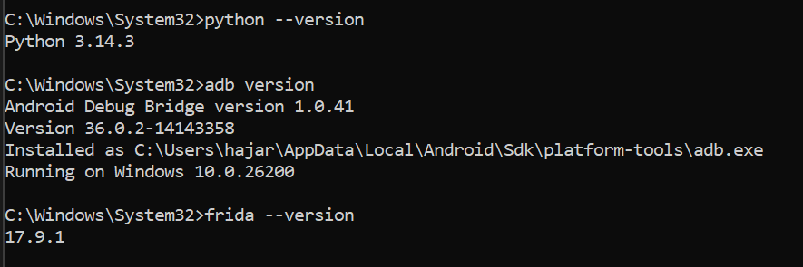
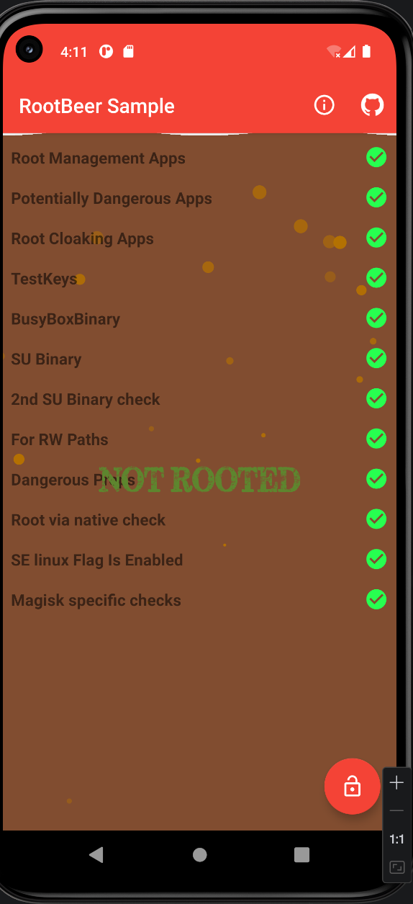
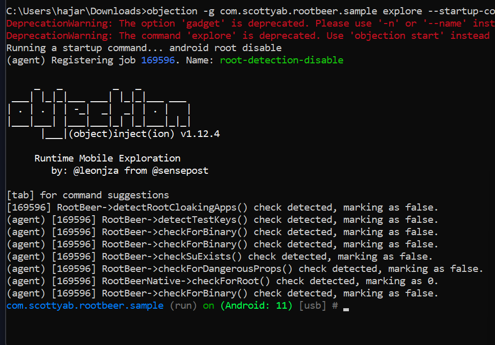
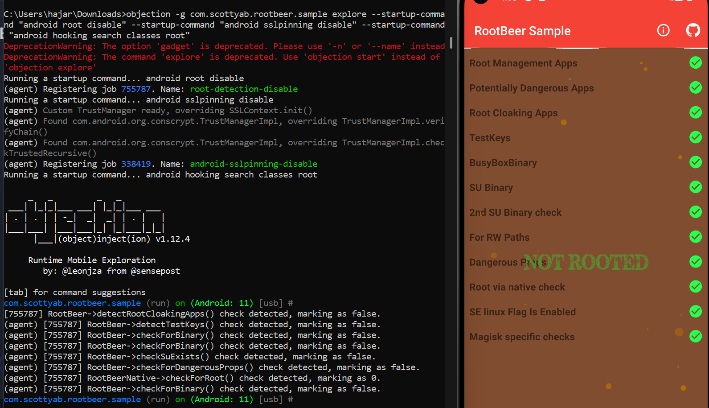
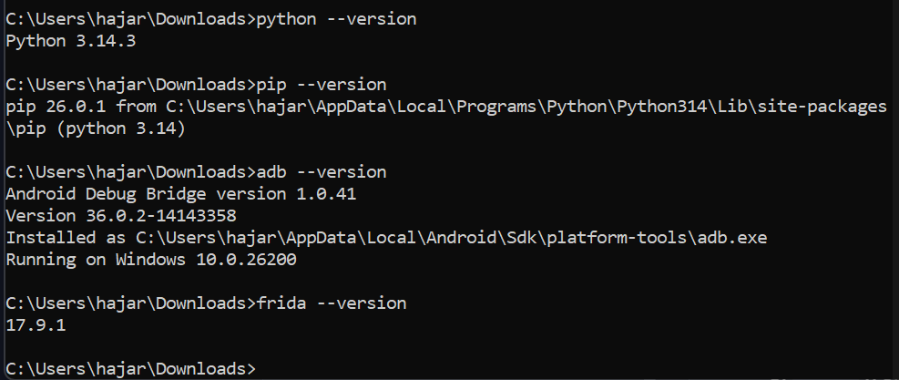
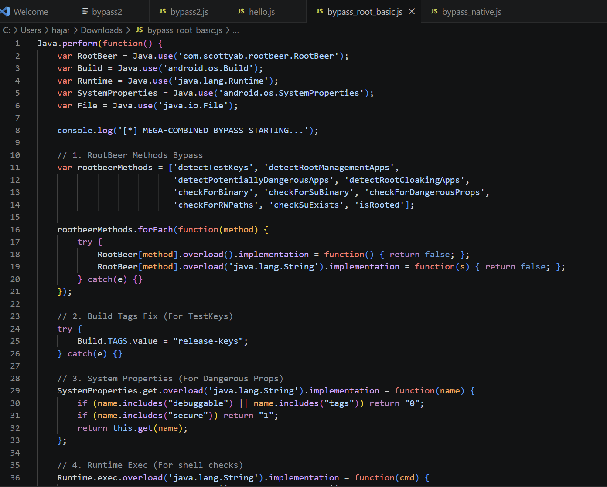
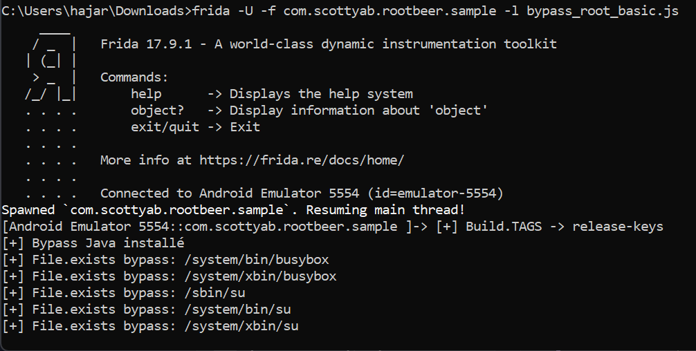
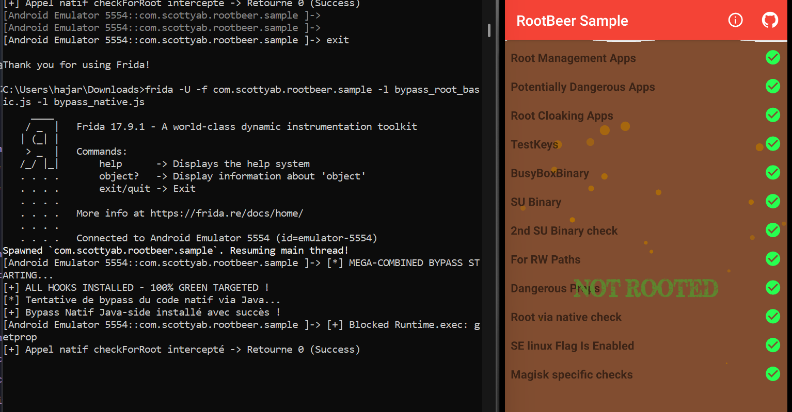

# Analyse Dynamique et Contournement de Sécurités Android


**Auteur :** Chaira Hajar 
**Discipline :** Sécurité des Applications Mobiles  
**Date :** 05 Mai 2026

---

## 1. Introduction Générale
L'analyse dynamique d'applications mobiles consiste à observer et modifier le comportement d'une application pendant son exécution. Ce cycle de laboratoires se concentre sur le **Bypass de Détection de Root**, une protection courante visant à empêcher l'exécution d'applications sensibles sur des appareils compromis. Nous avons exploré trois approches : l'automatisation par modules (Medusa), l'exploration facilitée (Objection) et l'instrumentation manuelle (Frida).

---

## 2.  Automatisation avec Medusa
Le premier laboratoire visait à découvrir l'outil **Medusa**, un framework modulaire basé sur Frida qui permet de sélectionner des "recettes" de bypass sans écrire de code.

### 2.1 Méthodologie
L'utilisation de Medusa repose sur une interface console permettant de charger des modules spécifiques. Pour RootBeer, nous avons utilisé le module `rootbeer_detection_bypass`.

### 2.2 Résultats et Limites
Le bypass a été réussi pour les tests Java classiques. Cependant, nous avons rencontré une difficulté avec le flag **SELinux**, qui est resté rouge initialement. Nous avons dû intervenir au niveau du système via ADB pour forcer l'état `Enforcing`.

> [!NOTE]
> **Capture 12.1 :** Interface de Medusa et chargement des modules.
> 
>
> **Capture 12.2 :** Résultat du scan après application des modules.
> 

---

## 3. Exploration avec Objection
Objection est une surcouche à Frida qui transforme l'analyse dynamique en une expérience proche d'un shell interactif.

### 3.1 Apport d'Objection
Contrairement à Medusa, Objection permet une exploration en temps réel de la mémoire (recherche de classes, de méthodes, surveillance des variables). La commande intégrée `android root disable` est extrêmement puissante car elle regroupe des dizaines de hooks en une seule instruction.

### 3.2 Mise en œuvre
Nous avons utilisé la stratégie de **Spawn** pour injecter le bypass dès la première seconde d'existence du processus.

> [!NOTE]
> **Capture 13.1 :** Connexion réussie et invite de commande Objection.
> 
>
> **Capture 13.2 :** État 100% Green (Bypass total incluant SELinux).
> 

### 3.3 Bonus : Analyse des appels natifs
Grâce à `frida-trace`, nous avons pu isoler les appels à la fonction native `fopen`, prouvant que l'application tente d'ouvrir des fichiers système pour détecter le root.

---

## 4.  Instrumentation Avancée avec Frida Pur
Ce dernier laboratoire est le plus technique. Il a consisté à écrire nos propres scripts JavaScript pour comprendre le fonctionnement interne des outils précédents.

### 4.1 Préparation de l'environnement
Avant toute injection, nous avons validé la communication entre le PC et le serveur Frida distant.

> [!NOTE]
> **Capture 14.1 :** Vérification des versions Python, ADB et Frida.
> 

### 4.2 Le Script "Mega Bypass"
Nous avons développé un script capable d'écraser (overwrite) les méthodes de la bibliothèque RootBeer. L'utilisation des `.overload()` a été nécessaire pour gérer les différentes signatures de fonctions.

**Exemple de code implémenté :**
```javascript
RootBeer.isRooted.overload().implementation = function() { return false; };
SystemProperties.get.overload('java.lang.String').implementation = function(name) {
    if (name.includes("debuggable")) return "0";
    return this.get(name);
};
```

### 4.3 Bypass bypass_root_basic.js

> [!IMPORTANT]
> 
> 
> 

---

## 5. Synthèse et Comparaison des Outils

| Outil | Avantages | Inconvénients | Usage Idéal |
| :--- | :--- | :--- | :--- |
| **Medusa** | Très rapide, prêt à l'emploi. | Moins de contrôle sur les détails. | Analyse rapide de masse. |
| **Objection** | Excellente exploration runtime. | Dépend de scripts pré-écrits. | Pentest d'applications complexes. |
| **Frida Pur** | Puissance illimitée, bypass sur mesure. | Courbe d'apprentissage élevée. | Recherche de vulnérabilités / Malware. |

---

## 6. Conclusion et Perspectives
Ce cycle de travaux pratiques a démontré que la détection de root "in-app" est une mesure de sécurité fragile face à un attaquant utilisant l'instrumentation dynamique. Pour une protection réelle, les développeurs doivent se tourner vers des solutions basées sur le matériel (Hardware Attestation) comme Google Play Integrity.

D'un point de vue utilisateur, le passage à des solutions de masquage au niveau du noyau (Kernel-level) comme **Magisk avec Zygisk** reste la méthode la plus robuste pour une utilisation quotidienne, car elle n'implique pas d'injection de code détectable au niveau applicatif.

---

